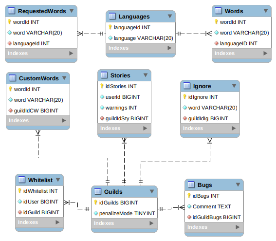
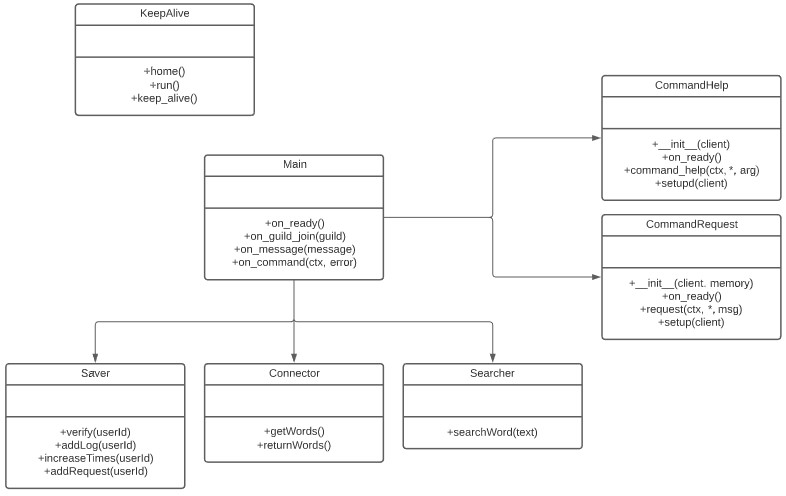

# Requirements definition

## System actors

- User
- Rude API
- Discord bot
- Discord API

## User requirements

The user can add the bot to a Discord server to filter it and prevent the use of the saved _offensive words_, and also can add a personal list of banned words. If anyone want, can make requests to add new words by using a simple command with the bot.

## System requirements

The API has the property of being modified **only** by the _requests system_, which is connected to the bot and administrated by the community via requests and follows. The API and the bot will update their information every month.

## Functional requirements

- **API** capable of:
  - Always is active.
  - Have an accessible database of official offensive words.
  - Have a method to retrieve information from the database.
- **Discord bot** capable of:
  - Always is active.
  - Get Discord messages.
  - Ban automatically.
  - Get information from the API.
  - Send error or bug messages found by the community.
  - The bot has space for memory.
  - Being customized:
    - Grant usage permissions.
    - _Penalize_ or _No penalize_ mode.
    - Add and delete self-selected offensive words to censor them.
    - Ignore self-selected words.
  - Send default Discord messages for:
    - “In-server” configuration which:
      - Can send user history as:
        - Individual user story.
        - List of all warned/banned people in the guild.
      - Help command which:
        - Show commands.
        - Can give you the documentation page.
    - Warning messages.
    - Ban messages.
    - Weekly resume for RudeBot Managers.
    - Warning alerts for RudeBot Managers.
    - Ban alerts for RudeBot Managers.
  - Can clean user history of:
    - Individual user.
    - All users.
  - Can unban people by:
    - Individual user.
- **Database** capable of:
  - Always is active.
  - Store requests.
  - Store custom server settings.

## Non functional requirements

- The maximum amount of warnings until someone can get banned is five.
- The maximum number of requests per user every month is five.
- The request period is one month.
- The review period is three days. Once is finished everyone can request again.
- Existing words cannot be suggested.
- The bot can only unban and clean history if a RudeBot Manager asks for it.
- A guild can have up to 15 custom words.
- A guild can have up to 15 ignored words.
- A guild can have up to 10 users in their whitelist.
- A user can send a bug report every 24 hours.

## Changes

- Management page canceled.
- Poorly defined requirements were removed, as "API search system".
- Impossible requirements were removed, as "Censoring specific words" (no one can edit someone else's messages).
- Unnecessary requirements were removed, as "Message when someone joins the server" (the bot objective is protect a chat, not maintain it), "On/Off mode" (its more logical kick the bot), and "Saving top 10 words" (it can be calculated easily and its not work of the bot).
- Database requirements were added.
- "Always is active" requirement was added.
- "API search system" was modified to "Have a method to retrieve information from the database" requirement.
- The request maximum amount was changed to 5.

## Use cases diagram

> Icons designed by [Flat Icons](https://www.flaticon.es/autores/flat-icons) from [Flaticon](https://www.flaticon.es/), and background picture by [Gerrit Tisdale](https://www.pexels.com/es-es/foto/luces-de-neon-rosadas-y-amarillas-en-una-habitacion-oscura-3864610/) from [Pexels](https://www.pexels.com/es-es/).

The Discord users will only use the bot generally for protecting their servers.

Developers may use the bot for protecting their servers, and will use the Rude API for developing their own projects.

The API System is a representation of the link between the Database and Rude API, it only gets predefined information from the database and returns it.

The Bot System works using the Discord API and following their own code. It represents the link between the Discord Bot, the Database (for sending information), and the Rude API (getting words).

## Database diagram

## Discord bot classes diagram

[Click here to read the bot documentation.](../Code/DiscordBot/RudeApiV3/README.md)

[<- Return to index](../README.md)
