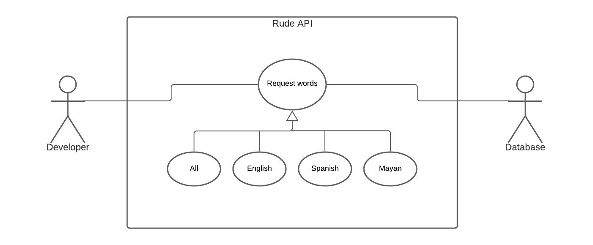
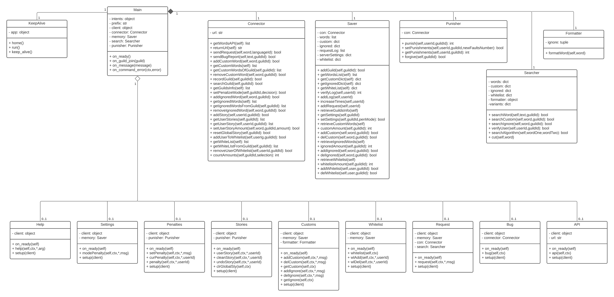

# Requirements definition

## System actors

- Discord users
- Developers
- Rude API
- Discord API

## User requirements

The user can add the bot to a Discord server to filter it and prevent the use of the saved _offensive words_, and also can add a personal list of banned words. If anyone want, can make requests to add new words by using a simple command with the bot.

## System requirements

The API has the property of being modified **only** by the _requests system_, which is connected to the bot and administrated by the community via requests and follows. The API and the bot will update their information every month.

## Functional requirements

- **API** capable of:
  - Always is active.
  - Have an accessible database of official offensive words.
  - Have a method to retrieve information from the database.
- **Discord bot** capable of:
  - Always is active.
  - Get Discord messages.
  - Ban automatically.
  - Get information from the API.
  - The bot has space for memory.
  - Manage commands:
    - Send word requests.
    - Provide penalties management.
    - Provide user stories management.
    - Provide API information.
    - Send error or bug messages found by the community.
  - Being customized:
    - Grant usage permissions.
    - _Penalize_ or _No penalize_ mode.
    - Add and delete self-selected offensive words to censor them.
    - Ignore self-selected words.
    - Manage a whitelist.
  - Send default Discord messages for:
    - “In-server” configuration which:
      - Can send user history as:
        - Individual user story.
      - Help command which:
        - Show commands.
        - Can give you the documentation page.
    - Warning messages.
    - Ban messages.
    - Warning alerts for RudeBot Managers.
    - Ban alerts for RudeBot Managers.
  - Can clean user history of:
    - Individual user.
    - All users.
- **Database** capable of:
  - Always is active.
  - Store API information.
  - Store requests.
  - Store custom server settings.

## Non functional requirements

- The maximum amount of warnings until someone can get banned is five.
- The maximum number of requests per user every month is five.
- The request period is one month.
- The review period is three days. Once is finished everyone can request again.
- Existing words cannot be suggested.
- The bot can only unban and clean history if a RudeBot Manager asks for it.
- A guild can have up to 15 custom words.
- A guild can have up to 15 ignored words.
- A guild can have up to 10 users in their whitelist.
- A user can send a bug report every 24 hours.

## Changes

- Management page canceled.
- Poorly defined requirements were removed, as "API - search system".
- Impossible requirements were removed, as "Censoring specific words in messages" (no one can edit someone else's messages).
- Unnecessary requirements were removed, as "Message when someone joins the server" (the bot mains objective is to protect a chat, not maintain a community), "On/Off mode", and "Saving top 10 words".
- Database requirements were added.
- "Always is active" requirement was added.
- "API search system" was modified to "Have a method to retrieve information from the database" requirement.
- The request maximum amount was changed to 5.
- Added a cooldown requirement to the bug reports.
- Added requirements that were planned in Trello but not defined in the documentation, mostly in bot's description (whitelist, requests, bugs, and some commands).
- Deleted requirement for weekely resumes.
- Banning system is implemented but in occassions it could get buggy, so we decided to remove the unban requirement.
- Added a command for getting information of the API.

## Use cases diagram

Discord users involve every kind of people, so our two target groups make part of this community. As you can see, every person can interact with the bot by sending a message or invoking a command.

In the messaging branch, we can appreciate the flow of the bot. At the very begginig the bot checks if the user is on the whitelist, and there is two options, in case they form part of it the bot will ignore the message, else the bot will start the analize. In this case if the text does not have offensive words, the bot will ignore the message, but, if a offensive word appears the bot will check the Penalize Mode to know if it is neccessary to make a punishment (and send a report) or not.

In the command branch, it is possible to see that it does not have a complex process, it just recieves a command request, analizes it, executes it, and finnaly sends an output message. In case something gone wrong while asking the command or executing it, the bot will notify it.

Its important to say that the API provides the banned words and the Discord API makes possible to delete messages and send the result of the commands.

Here is the section for developers which will love to use the API. Their use is very simple, just make a request and the API will send you the information.

## Database diagram

The API can only access to the Languages and Words tables, the rest of the database is for the bot's functionability. All this process is made by the model class "Connector" which works as a link with the API, the database, and the Bot.

[Click here to go and see the code.](../Code/API/)

## Discord bot classes diagram

The Main class is the hearth of the bot, it is the responsible of initializing their components (a connector, a saver, a searcher and a punisher) to make their main task, delete offensive messages. Also is related with a class which helps to maintain activated the execution of the bot in a cloud service. Further, it has some commands to help Rudebot Managers into their task of bringing peace in their guild.

[<- Return to index](../README.md)
