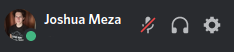
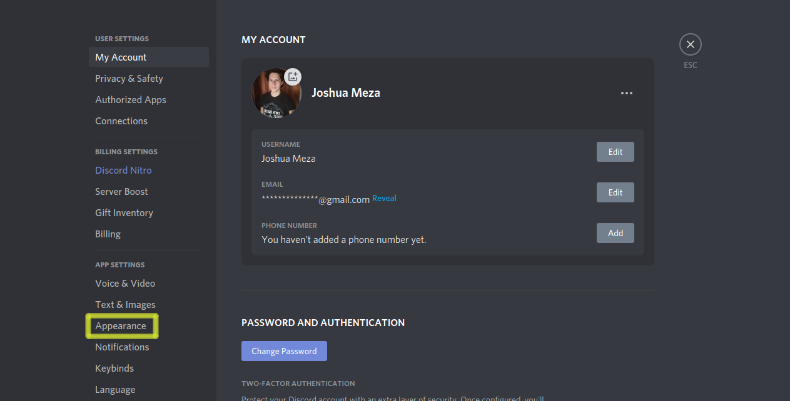
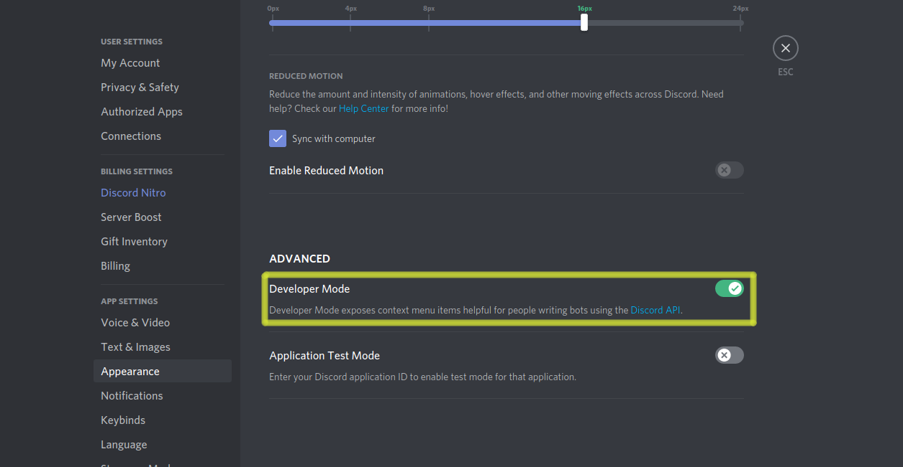
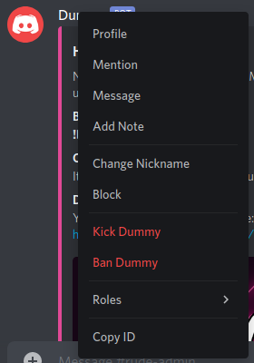

# Guide for installing the bot

## Adding it into your server

It's really simple, just [click here](https://discord.com/api/oauth2/authorize?client_id=807868841035300864&permissions=8&scope=bot) and select the server which you want to protect.

## Actions once joined

When the bot joins into your server, it creates a Category called "RUDEBOT MANAGEMENT" and a Text channel called "rude-admin", in where no one except users with "Rudebot Manager" role can see the messages, send new ones or even use the commands.

## Get in touch with the commands

It is very important to know that exclusively people with "Rudebot Manager" role can execute the commands, which are also only available into the "rude-admin" channel.

The most useful command you can enjoy is `!help` and its variants, with them you can easily learn how to operate the bot.

### Commands summary

**Note:** Extra descriptions are obtainable in the bot help commands.

#### Help command

- `!help` Displays the list of options.
- `!help all` Displays all commands.
- `!help settings` Displays the setting command.
- `!help penalties` Displays penalties related commands.
- `!help stories` Displays stories related commands.
- `!help lists` Displays lists related commands.
- `!help customs` Displays custom words related commands.
- `!help requests` Displays the requesting command.
- `!help bugs` Displays the bug reporting command.
- `!help API` Displays the API command.

#### Setting command

- `!modePenalty [on/off]` This command changes the state of the Penalize Mode. By default it is active.

#### Penalties commands

- `!setPenalty [user_id]=[new_faults_number]` Change the faults amount of a user.
- `!curPenalty [user_id]` See the actual fault instances previous to ban a member.
- `!penalty [user_id]` Add a penalty to a user.

#### Stories commands

- `!userStory [user_id]` Show the faults story of a user.
- `!cleanStory [user_id]` Clean the faults story of a user.
- `!undoStory [user_id]` Remove one fault to a user.
- `!clrGlobalSty` Clean everyone's faults story.

#### Lists commands

- `!whitelist` See guild whitelist.
- `!wlAdd [user_id]` Add a user into the whitelist.
- `!wlDel [user_id]` Delete a user from the whitelist.

#### Custom Words commands

- `!addCustom [word]` Add a custom word.
- `!delCustom [word]` Delete a custom word.
- `!getCustom` See your guild's custom words.
- `!addIgnore [word]` Add an ignored word.
- `!delIgnore [word]` Delete an ignored word.
- `!getCustom` See your guild's ignored words.

#### Request command

- `!request [word],[language]` Upload a word to be added into the global banned words list.

#### Bug command

- `!bug [text]` Send a bug report.

#### API command

- `!API` Sends the API link.

## Developer Mode

Some commands needs you to introduce an User Id to work, and the only way to get it is to enable the **Developer Mode** view. How are we suposed to do that? Well, do the following:

Go to your user settings by clicking the gear, which is located in the rigthmost side of your profile information:

Then, go to the Appearance section:

And finally, scroll down until you see the Developer Mode change option and enable it:

Now you can copy the user's id!

## Documentation

[Click here to read the bot documentation.](../Code/DiscordBot/RudeApiV3/README.md)

[<- Return to index](../README.md)
